# MaskRCNN
物体検出、セグメンテーションの手法である MaskRCNN を Keras で実装しています。   

MaskRCNN は ICCV'17 Best Paper に選出された手法です。  
（参考資料[^1]より。ICCV＝International Conference on Computer Vision）  
MaskRCNN は元となる FasterRCNN にインスタンス検出ネットワーク(mask head)を追加した以下のようなネットワーク構造になります。  
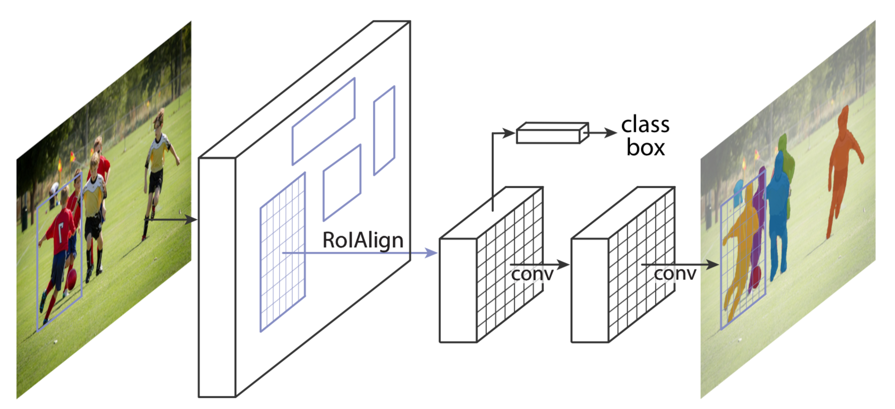
MaskRCNN論文より抜粋[^2]  

*class box* が FasterRCNN のクラス識別、バウンディングボックス検出を行うネットワークで、その下の畳込み2層（本実装では4層+逆畳み込み1層としている）がインスタンス検出ネットワーク。

# 環境
- Python 3
- TensorFlow(TensorFlow-gpu)
- Keras
- OpenCV
- COCO API

# 学習に利用したデータセット
COCO  
http://cocodataset.org/  
```
mkdir /path/to/dataset
cd /path/to/dataset
wget http://images.cocodataset.org/zips/train2017.zip
wget http://images.cocodataset.org/zips/val2017.zip
wget http://images.cocodataset.org/annotations/annotations_trainval2017.zip
unzip train2017.zip
unzip val2017.zip
unzip annotations_trainval2017.zip
```

# 論文と異なる点、制約事項
学習時間、コスト削減のため、以下のような制限を設けた。　　
(GPUインスタンス費用がきついため。。。)
- バックボーンネットワークにはKerasの学習済みのVGGを利用。
  - 論文ではResNetかFPN。
- 検出オブジェクトを 人(ラベル:person) に限定。
- 入力画像サイズを224＊224ピクセルに縮小。
  - 学習済みVGGの入力サイズに合わせる。
- 高さ、または幅が23ピクセル以下のオブジェクトは学習対象外。

# 使い方
## 学習
3ステージに分けて学習する。
- stage1  
RPNのみの学習。
```
python3 train_mrcnn.py --data_path /path/to/dataset --stage 1
```
- stage2  
Headのみの学習。
```
python3 train_mrcnn.py --weights_path ./model/maskrcnn.h5 --data_path /path/to/dataset --stage 2
```
- stage3  
RPN+Headの学習。
```
python3 train_mrcnn.py --weights_path ./model/maskrcnn.h5 --data_path /path/to/dataset --stage 3
```

train_mrcnn.pyで指定する各学習のイテレーションは少なめなので、実行環境や許容されるコストに合わせて調整してください。


## テスト
```
python3 predict_mrcnn.py --weights_path ./model/maskrcnn.h5 --input_path /path/to/testdata
```

### 結果
以下のように学習した結果。
- stage1: 10万イテレーション
- stage2: 4万イテレーション
- stage3: 無し

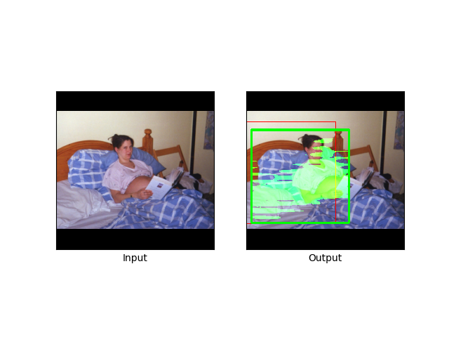
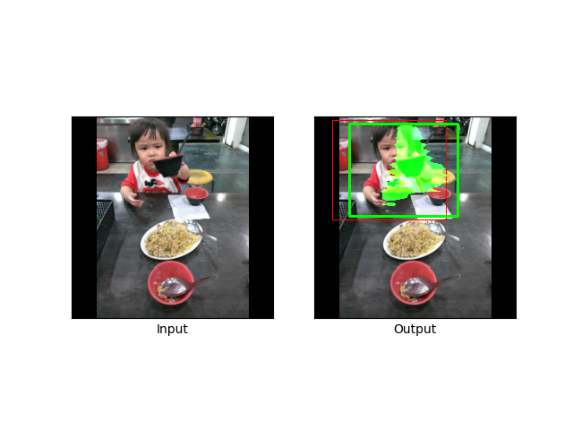

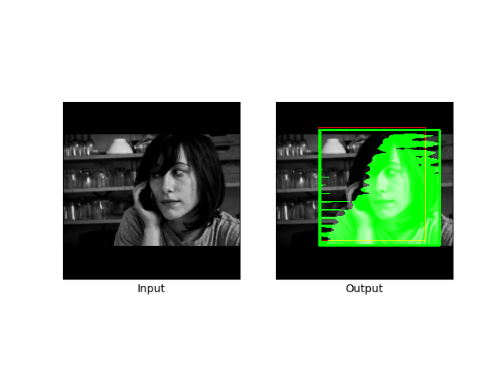
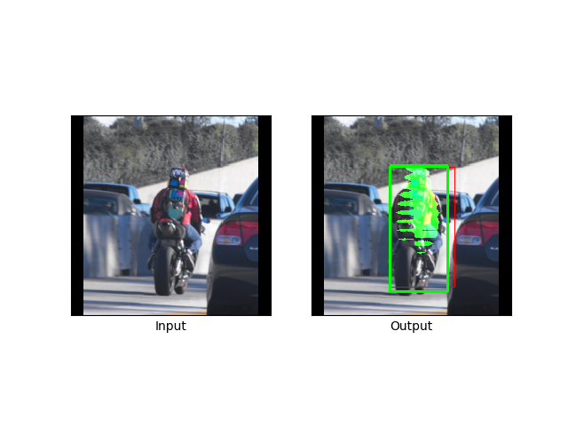
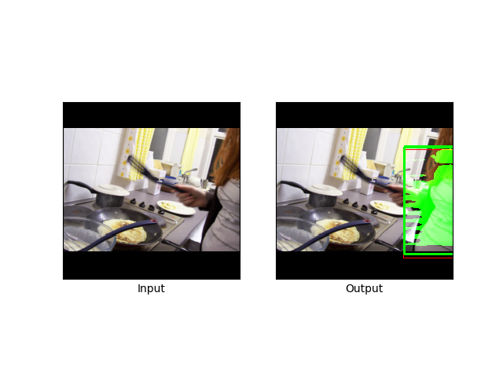
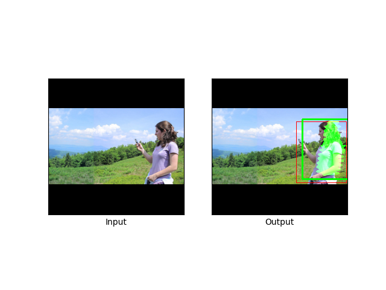
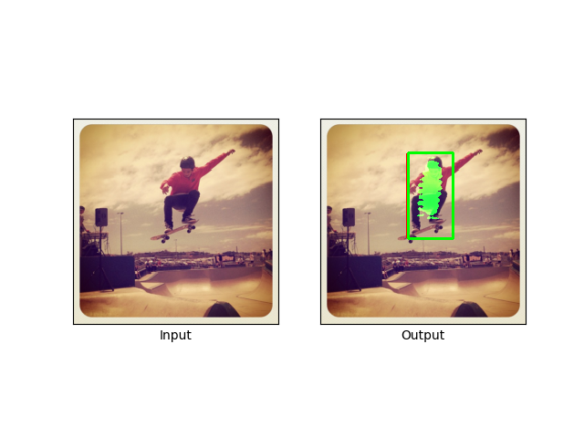

# 課題
- マスクの精度が低い。
  - 更なる学習が必要。
- 画像の周辺部の検出精度が低い？
  - 周辺部のアンカーを残す？
- サイズの小さいオブジェクトの検出
  - 除外条件「高さ、**または**幅が23ピクセル以下」の影響か。
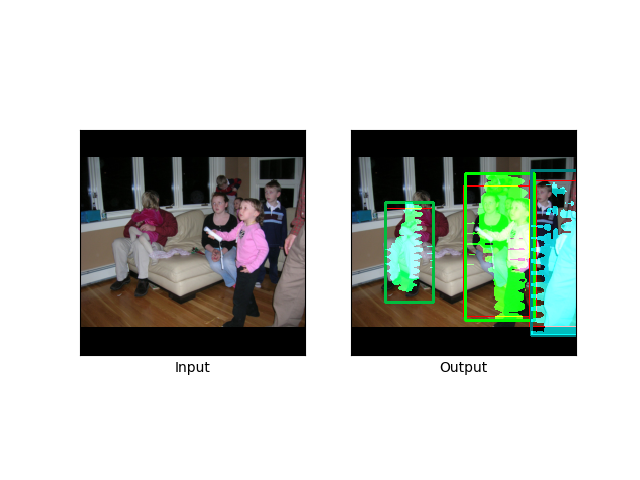
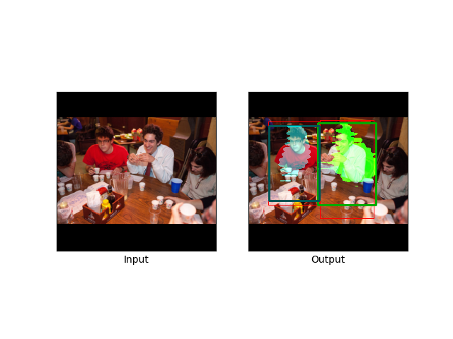
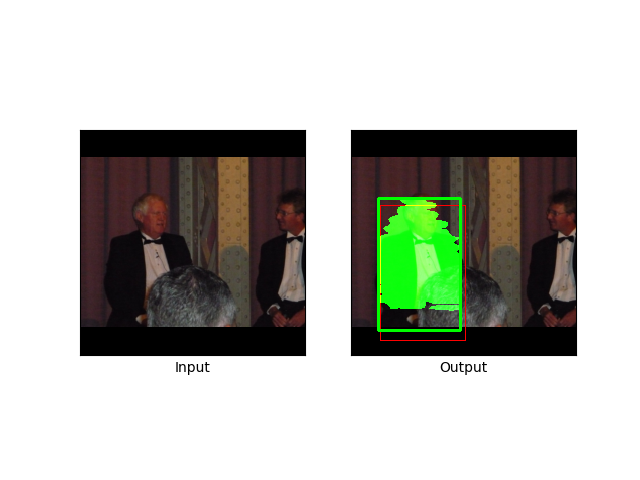
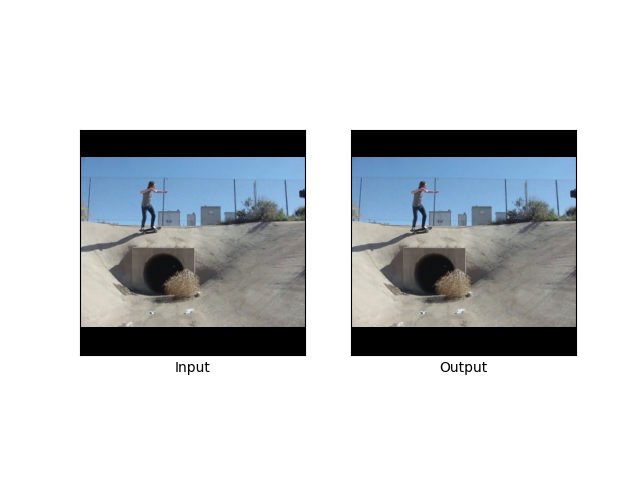
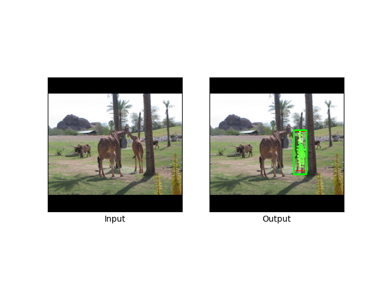


# 参考資料
- https://arxiv.org/abs/1703.06870  
- https://engineer.dena.jp/2017/12/chainercvmask-r-cnn.html  
- https://qiita.com/yu4u/items/5cbe9db166a5d72f9eb8
- https://github.com/matterport/Mask_RCNN
- https://github.com/chainer/chainercv

[^1]: https://engineer.dena.jp/2017/12/chainercvmask-r-cnn.html  
[^2]: https://arxiv.org/abs/1703.06870  
